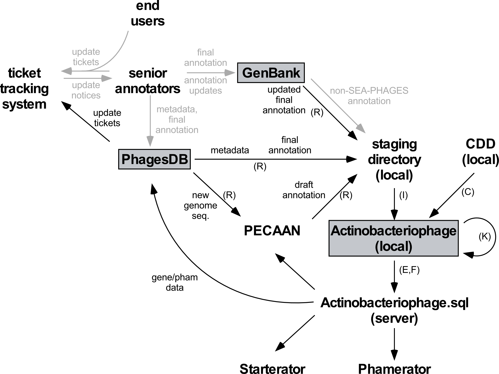

.. _actinodraft:

Actino_Draft data management pipeline
=====================================

.. toctree::
    :hidden:

    Email tickets <./ticket_email>
    Ticket tracking <./ticket_tracking>

The ``pdm_utils`` package is designed to facilitate the management of specifically-structured phage genomics MySQL databases. The database management process represents one component of a much larger data management pipeline in the SEA-PHAGES program, which has been described in detail elsewhere.

.. _figpipeline:

    Overview of the pipeline to maintain and update Actino_Draft

SEA-PHAGES genome sequencing and annotation
-------------------------------------------

The SEA-PHAGES program begins with identification of new phages. Thousands of undergraduate students isolate and purify new actinobacteriophages in the SEA-PHAGES course (:ref:`Hanauer et al., 2017 <hanauer2017>`). Lysates are sent to the University of Pittsburgh where the genomes are sequenced, assembled, clustered (and subclustered) relative to other actinobacteriophages. The genome sequence, along with its metadata (e.g. cluster, subcluster, host, etc.), is uploaded to PhagesDB.

After new genomes are sequenced, genes need to be annotated and easily accessible for several applications and data analysis tools, including Phamerator, PhagesDB, Starterator, and PECAAN (:pecaan:`Phage Evidence Collection And Annotation Network (PECAAN) website <>`). Gene annotation is an intensive, multi-step process involving many participants and several stages of quality control:

    1. Automated 'draft' annotations are generated using tools that predict coding and tRNA genes. The draft annotations are used as a reference for manual review.

    2. Manual gene annotations are generated by undergraduate students in the SEA-PHAGES bioinformatics course using a variety of computational tools.

    3. A team of trained, senior annotators review student annotations and generate preliminary final annotations.

    4. The manual annotations are evaluated using several automated and semi-automated quality control (QC) checks, and they replace the draft annotations.

    5. Annotators submit the final annotations to GenBank where they are assigned a unique accession identifier.

    6. Annotations can be continually refined, and corrections or updates can be made to the final GenBank annotations as often as needed by authors that are specifically listed in the GenBank record.

Phage genomics database
-----------------------

A specifically-structured :ref:`MySQL database <dbstructure>` is used to store phage genome and gene annotation data in a standardized format that enhances downstream genomics analyses and that can be easily distributed to end-users. Different versions, or instances, of this genomics database can be constructed for different research projects.

The Actino_Draft database
-------------------------

The primary instance of this database, the Actino_Draft, works in conjunction with the :phagesdb:`PhagesDB <>` database as the primary source of genomics data for the SEA-PHAGES program. This database serves not only as a repository of final, refined gene annotations, but also as a tool to facilitate the dynamic, iterative improvement of annotations. Using the ``pdm_utils`` toolkit, a data management pipeline is constructed to accommodate the needs of this constantly updated database.

The Actino_Draft management pipeline relies on :ref:`GenBank-formatted flat files <flatfile>` as the primary file format for importing annotation data into the database. During the import process, data is parsed from flat files. If a previous annotated version of the genome is already present in the database, all data relating to that genome is removed and the genome is completely re-imported using the new flat file. Only in limited circumstances are individual fields populated with data extrinsic to a flat file or retained between rounds of genome replacement.

The Actino_Draft data management pipeline
-----------------------------------------

The most up-to-date version of Actino_Draft is stored on the Hatfull lab's public server as a single file, Actino_Draft.sql, with an assocaited version file, Actino_Draft.version. The process of maintaining and updating this database occurs on the database administrator’s local computer, and the new version is made available on the public server. Below is a description of how ``pdm_utils`` is used during a typical round of database updates:

    1. **Retrieving the newest version of Actino_Draft.** Ensure the newest version of the database is locally installed::

        > python3 -m pdm_utils get_db Actino_Draft ./ -a

    2. **Retrieving new data to import into the database.** New data that needs to be added to the database is retrieved from various sources and staged in a structured local directory for import. *get_data* creates separate staged directories and import tables for different types of data to be imported to minimize potential ticket conflicts::

        > python3 -m pdm_utils get_data Actino_Draft ./ -a -c get_data_config.txt

    3. **Update specific fields.** New updates are implemented predominantly in the *phage* table::

        > python3 -m pdm_utils update Actino_Draft -f update_table.csv

    4. **Import new and replacement genome data.** New data (mostly in the form of flat files) is parsed and imported into the *phage* and *gene* tables. The *import* tool should be run separately for different types of genome data, in the following order:

        1. Auto-annotated genomes::

            > python3 -m pdm_utils import Actino_Draft ./pecaan/genomes/ ./pecaan/import_table.csv -p

        2. New final annotations::

            > python3 -m pdm_utils import Actino_Draft ./phagesdb/genomes/ ./phagesdb/import_table.csv -p

        3. Auto-updated SEA-PHAGES final annotations from GenBank::

            > python3 -m pdm_utils import Actino_Draft ./genbank/genomes/ ./genbank/import_table.csv -p

        4. Other miscellaneous genomes::

            > python3 -m pdm_utils import Actino_Draft ./misc/genomes/ ./misc/import_table.csv -p

    5. **Group gene products into phamilies.** Phamilies are created using MMseqs and stored in the *pham* and *pham_color* tables::

        > python3 -m pdm_utils phamerate Actino_Draft --steps 2

    6. **Identifying conserved domains.** Conserved domain data is retrieved from a local copy of the NCBI CDD and stored in the *gene*, *domain*, and *gene_domain* tables::

        > python3 -m pdm_utils cdd Actino_Draft ./cdd/

    7. **Increment database version.** After the database's content has changed, the database version number is updated in the *version* table::

        > python3 -m pdm_utils update Actino_Draft -v

    8. **Export the updated database to a single file.** The updated Actino_Draft database is exported from MySQL into a single file, Actino_Draft.sql, with a corresponding Actino_Draft.version file that stores the database version number::

        > python3 -m pdm_utils export sql Actino_Draft

    9. **Upload the database for public access.** The SQL file is uploaded to that Hatfull lab's public server, where it can be retrieved by end-users for downstream applications and data analysis tools::

        > python3 -m pdm_utils push -d ./new_version/

Non-routine maintenance:

    1. **Freeze a database for publication.**
    2. **Compare databases for data consistency.**
    3. **Make changes to the database schema.**
