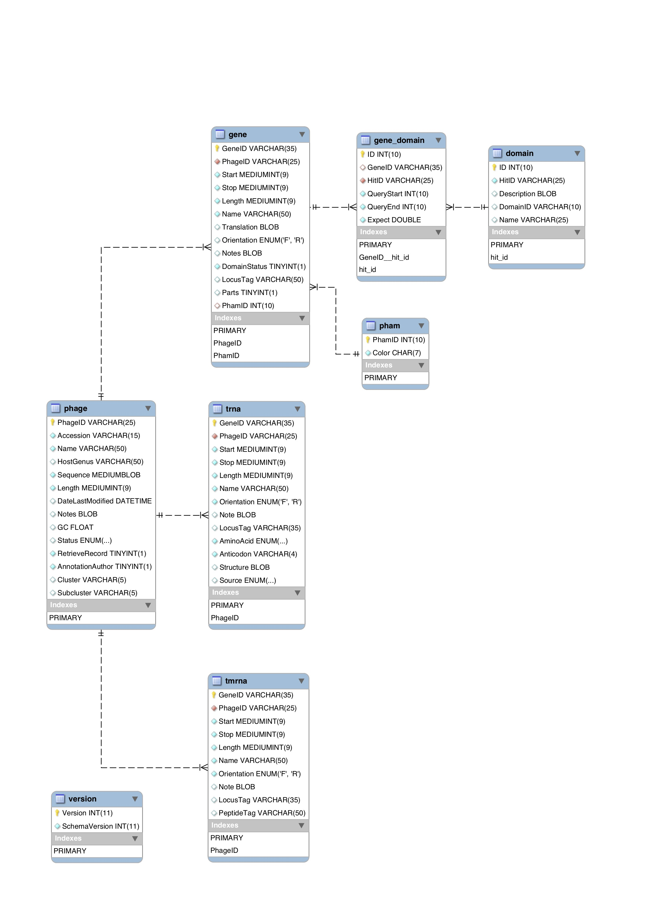

.. _dbstructure:

Database structure
==================

The database (schema version 10) contains the following tables:

.. toctree::
    :maxdepth: 1

    domain <./table_domain>
    gene <./table_gene>
    gene_domain <./table_gene_domain>
    phage <./table_phage>
    pham <./table_pham>
    trna <./table_trna>
    tmrna <./table_tmrna>
    version <./table_version>

.. _figschema:

    Schema Entity Relationship Diagram.
